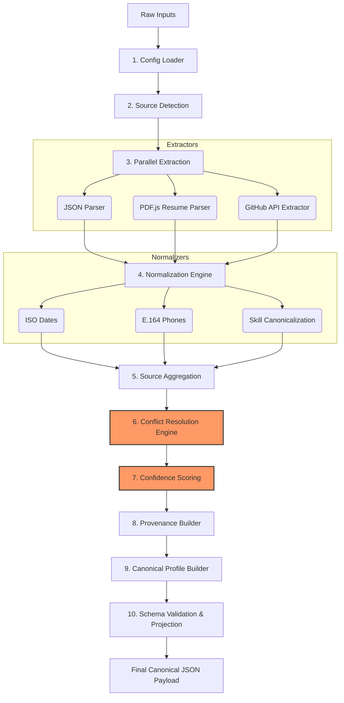
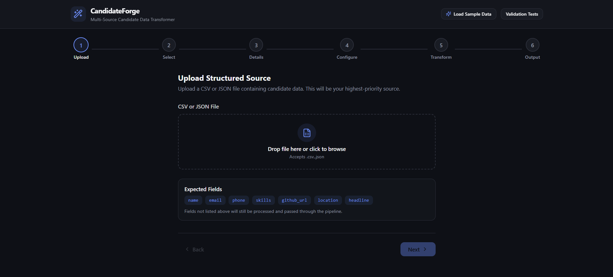
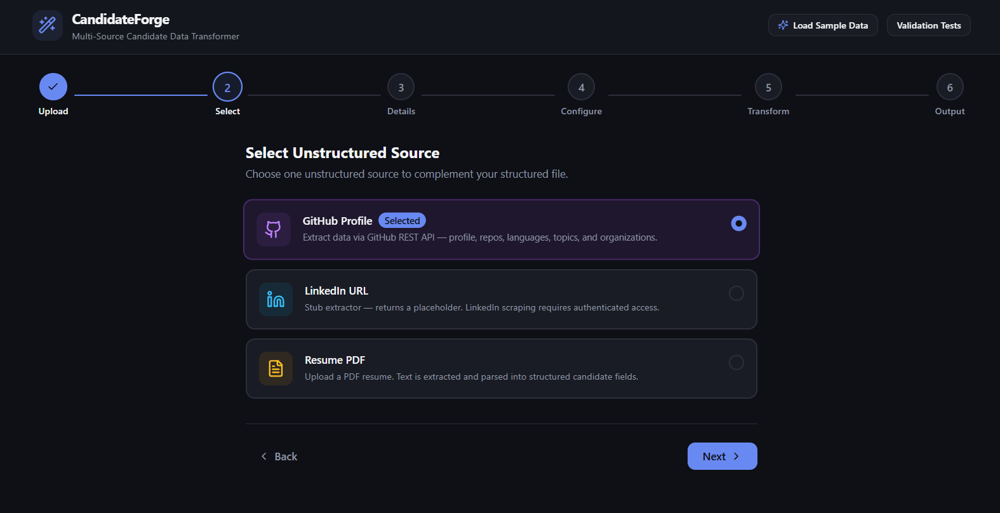
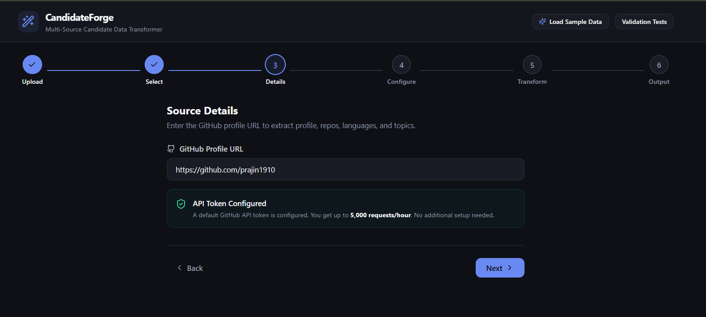
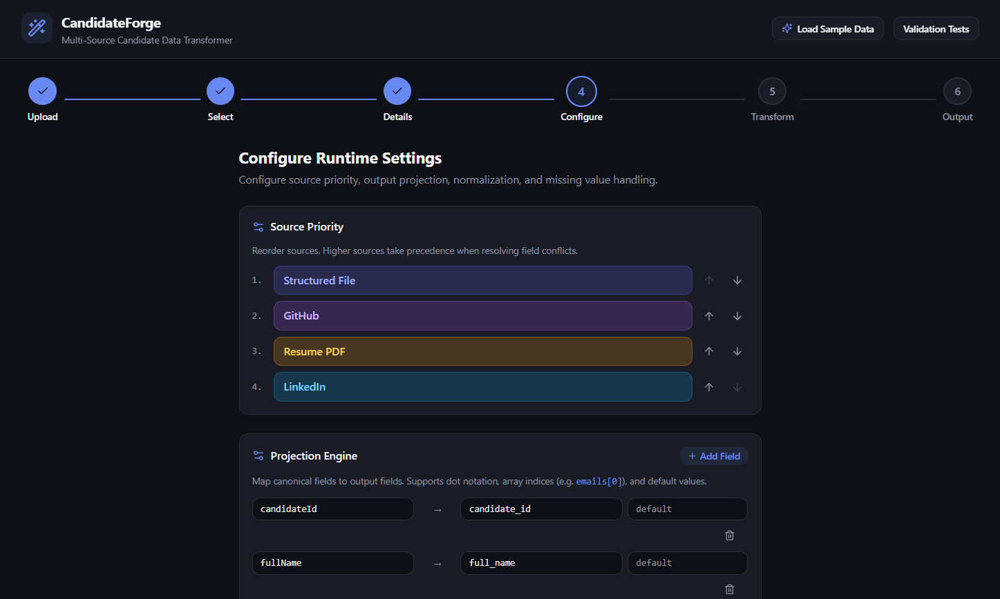
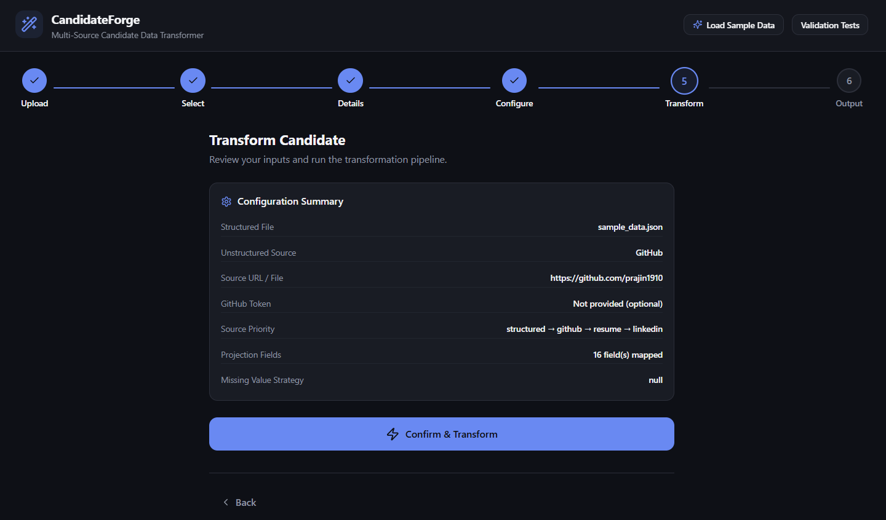
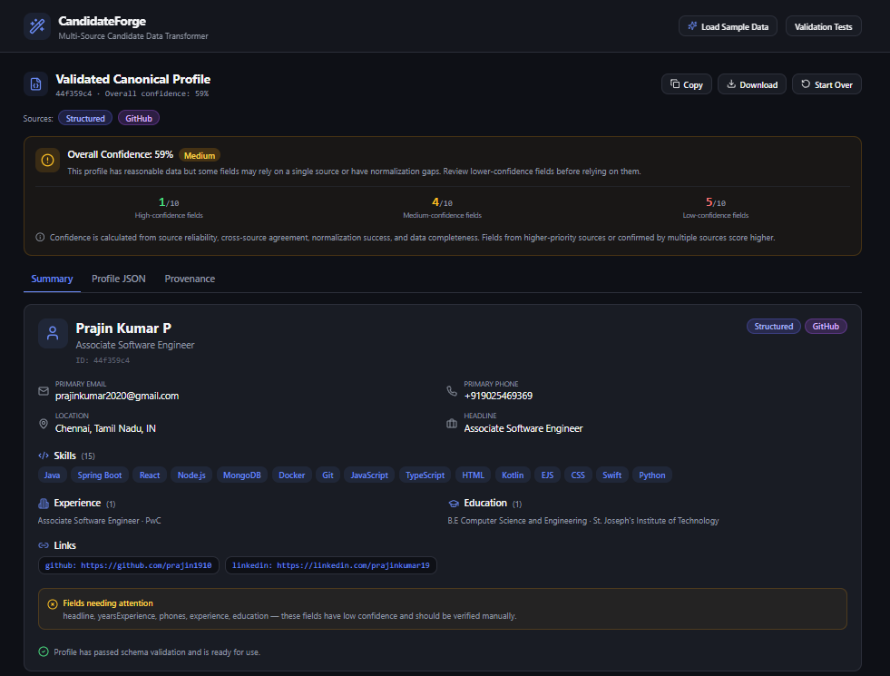
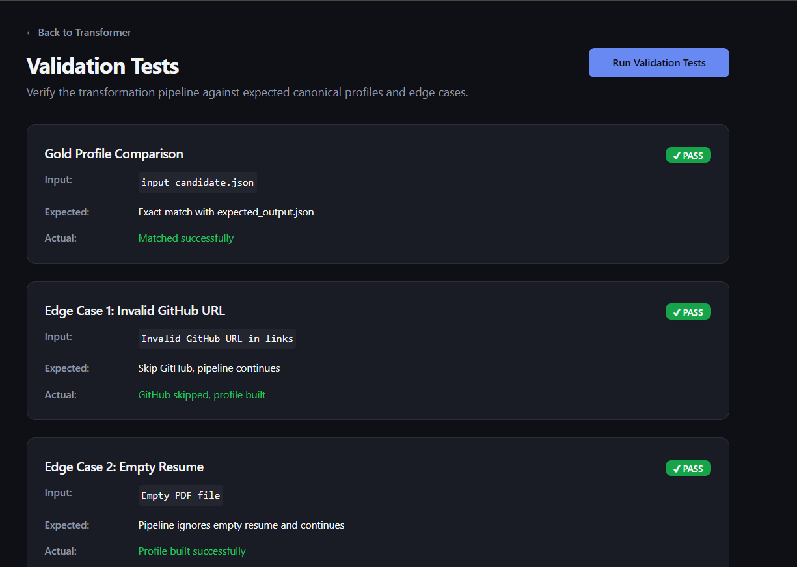

# CandidateForge: Multi-Source Candidate Data Transformer

CandidateForge is a robust, front-end heavy MERN-stack application (simulating an enterprise-grade backend processing pipeline) designed to consolidate messy, disjointed candidate data from multiple sources into a **Single Source of Truth** (Canonical Profile).

In the real world, HR candidate profiles consist of structured data (JSON/CSV), Resume PDFs, and social media links (GitHub/LinkedIn). CandidateForge extracts, normalizes, resolves conflicts, and securely aggregates these disparate data points into a perfectly validated and cleanly formatted JSON payload ready for database storage.

---

## 🛠 Architecture & Working Logic (Core Mechanisms)

CandidateForge employs a sophisticated **10-Stage Transformation Pipeline**. The entire mechanism is fully transparent and tracks provenance (where every piece of data originated) and calculates confidence scores for absolute reliability.

### The 10-Stage Transformation Pipeline Diagram

### Core Features
- **Source Priority Resolution:** If two sources conflict (e.g., Job Title on Resume vs GitHub), the Conflict Resolver picks the winner based on a strict priority hierarchy (e.g., `Structured Data > GitHub > Resume`).
- **Confidence Scoring:** Validates cross-source agreement. If both Resume and GitHub claim a candidate knows "React", the confidence score increases.
- **Normalization:** Raw "Jan 2023" becomes strict `2023-01-01T00:00:00.000Z`. "reactJS" becomes "React".

---

## 🖥 Application Walkthrough & Screens

CandidateForge provides a beautifully designed 5-step wizard to guide users through the pipeline execution.

### 1. Upload (Structured Data)
The first step expects the base payload. This is usually the data retrieved from an existing HR Application Tracking System (ATS).

### 2. Select (Additional Sources)
Here, the pipeline detects any additional attachments. Users can enable dynamic fetchers like the GitHub API or the PDF Resume Parser.

### 3. Details (Inputs)
Users provide the raw files and API URLs. For example, pasting the GitHub URL or dropping the Resume PDF into the Dropzone.

### 4. Configure (Pipeline Rules)
Users have total control over the backend pipeline rules. You can define how missing values are handled, toggle specific normalizers, and most importantly, drag-and-drop the **Source Priority** list which dictates how the Conflict Resolver behaves.

### 5. Transform (Execution)
The pipeline is triggered! You can view real-time execution logs as the system fetches API data, parses PDFs locally, and normalizes the payload.

### 6. Output Panel
The finalized Canonical Profile is presented with 100% transparency. The UI includes visual confidence badges, conflict resolution logs, and a Provenance map showing exactly which source contributed to each finalized field.

---

## 🧪 Automated Edge-Case Validation

To prove the pipeline is production-ready, CandidateForge includes an automated Validation Test suite.
You can view this at the `/validation` route. It validates against:
- **Gold Profile Comparison:** Ensures perfect accuracy against known expected outputs.
- **Duplicate Skills:** Ensures canonicalization accurately deduplicates messy arrays.
- **Missing / Invalid Fallbacks:** Ensures broken API links or empty PDFs do not crash the pipeline.

---

## 🚀 How to Test This Application

To test the application locally, you can use the provided sample inputs:

1. Copy the contents of the `sample_data.json` file and paste it into **Step 1 (Upload)**.
2. In **Step 3 (Details)**, provide the GitHub repository link: [https://github.com/prajin1910/](https://github.com/prajin1910/)
3. Click through to **Step 5** and hit **Transform**.
4. Witness the pipeline intelligently aggregate your JSON with the live GitHub API data!

---

## 🎥 Video Explanation

For a full guided walkthrough of the backend architecture, the pipeline codebase, and the frontend wizard UI, please watch the explanation video below:

  

