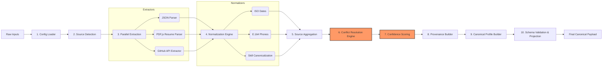

# CandidateForge: Multi-Source Candidate Data Transformer

### 🔗 [View Live Application Demo](https://candidateforge.vercel.app/)

CandidateForge is a robust, front-end heavy MERN-stack application (simulating an enterprise-grade backend processing pipeline) designed to consolidate messy, disjointed candidate data from multiple sources into a **Single Source of Truth** (Canonical Profile).

In the real world, HR candidate profiles consist of structured data (JSON/CSV), Resume PDFs, and social media links (GitHub/LinkedIn). CandidateForge extracts, normalizes, resolves conflicts, and securely aggregates these disparate data points into a perfectly validated and cleanly formatted JSON payload ready for database storage.

## Table of Contents
- [System Architecture Overview](#system-architecture-overview)
- [Deep Dive: Core Pipeline Logic](#deep-dive-core-pipeline-logic)
- [Features](#features)
- [Tech Stack](#tech-stack)
- [Getting Started (Local setup implementation)](#getting-started-local-setup-implementation)
- [Application Walkthrough & Screens](#application-walkthrough--screens)
- [Automated Edge-Case Validation](#automated-edge-case-validation)
- [How to Test This Application](#how-to-test-this-application)
- [Video Explanation](#video-explanation)
- [Contact Me](#contact-me)

---

## System Architecture Overview

CandidateForge employs a sophisticated **10-Stage Transformation Pipeline**. The entire mechanism is fully transparent and tracks provenance (where every piece of data originated) and calculates confidence scores for absolute reliability.

*To save space, the full pipeline diagram is collapsed below. Click to expand!*

<details>
<summary><b>Click here to view the 10-Stage Transformation Pipeline Diagram</b></summary>



</details>

---

## Deep Dive: Core Pipeline Logic

To truly understand CandidateForge, you must look under the hood. The application simulates complex backend ETL (Extract, Transform, Load) logic entirely within the client-side architecture.

### 1. Extractor Engines
The pipeline begins by fanning out to specialized extractors based on the detected input types:
- **Structured JSON Extractor:** Parses standard HR data payloads.
- **GitHub API Extractor:** Automatically fires REST calls to `api.github.com` to fetch live repository data, primary languages, and profile metadata.
- **PDF Resume Extractor:** Utilizes `pdf.js` to parse raw buffer data from uploaded resumes into readable text chunks.

### 2. The Normalization Engine
Raw data is rarely clean. The normalizers sanitize data before it hits the conflict resolver:
- **Temporal Normalization:** Dates like `Jan 2023`, `01/23`, and `2023-01-01` are uniformly converted into strict ISO-8601 timestamps (`2023-01-01T00:00:00.000Z`).
- **Telecom Normalization:** Phone numbers strip out spaces and local prefixes, converting them to strict `E.164` international formats (e.g., `+919876543210`).
- **Taxonomy Canonicalization:** Arrays of skills (e.g., `["ReactJS", "react", "JAVA"]`) are forcefully lowercased, stripped of special characters, and deduplicated into a canonical set (`["react", "java"]`).

### 3. Conflict Resolution Strategy
When multiple sources provide the same piece of information (e.g., the JSON says the candidate's title is "Developer", but their Resume says "Senior Engineer"), the system must decide which to trust.
- The user defines a **Source Priority Hierarchy** (e.g., `Resume > GitHub > Structured Data`).
- The engine iterates through the priority list. It selects the highest-priority source that actually contains a valid, non-null value for that specific field.

### 4. Confidence Scoring Algorithm
CandidateForge calculates a mathematical "Trust Score" for every single data point.
- **Base Score:** A value extracted from a single source starts with a baseline confidence (e.g., `0.7`).
- **Cross-Validation Bonus:** If *multiple* sources independently agree on the same value (e.g., both the Resume and the JSON list "Docker" as a skill), the system mathematically boosts the confidence score up to a maximum of `1.0`.

### 5. Provenance Mapping
Data without a verifiable trail is dangerous. CandidateForge attaches a "Provenance Metadata Object" to every finalized field. Instead of just returning `"Chennai"`, the engine returns:
```json
{
  "value": "Chennai",
  "source": "resume",
  "confidence": 0.85,
  "timestamp": "2026-06-30T10:00:00Z"
}
```
This guarantees 100% transparency for downstream systems.

---

## Features

- **Dynamic Pipeline Configuration:** Users can toggle individual normalizers, adjust missing-value behaviors, and reorder priority hierarchies on the fly.
- **Live Output Telemetry:** Real-time visual logs stream into the UI as the pipeline transitions from extraction to normalization to aggregation.
- **Visual Confidence Badges:** The final Output Screen color-codes data points based on their mathematical confidence scores.
- **Automated Fallbacks:** If the GitHub API rate-limits the request or a PDF is entirely blank, the pipeline intelligently skips the source without crashing, falling back to lower-priority data.

---

## Tech Stack

- **Frontend Core:** React.js, TailwindCSS
- **Animations & Transitions:** Framer Motion (used for the seamless 5-step wizard and dynamic logs)
- **Data Parsing:** `pdf.js` (for complex document extraction)
- **State Architecture:** React Context API combined with heavily modularized Custom Hooks to separate UI logic from Pipeline execution.
- **Development Tooling:** Vite, Node.js

---

## Getting Started (Local setup implementation)

Follow these instructions to run the application locally on your machine.

### Prerequisites
- [Node.js](https://nodejs.org/) (v16 or higher recommended)
- Git installed on your local machine

### Installation

1. **Clone the repository:**
   ```bash
   git clone https://github.com/prajin1910/CandidateForge.git
   cd CandidateForge
   ```

2. **Install dependencies:**
   ```bash
   npm install
   ```

3. **Start the development server:**
   ```bash
   npm run dev
   ```

4. **Open the Application:**
   Open your browser and navigate to `http://localhost:5173` (or the port provided in your terminal).

---

## Application Walkthrough & Screens

CandidateForge provides a beautifully designed 5-step wizard to guide users through the pipeline execution.

### 1. Upload (Structured Data)
The first step expects the base payload. This is usually the data retrieved from an existing HR Application Tracking System (ATS).


### 2. Select (Additional Sources)
Here, the pipeline detects any additional attachments. Users can enable dynamic fetchers like the GitHub API or the PDF Resume Parser.


### 3. Details (Inputs)
Users provide the raw files and API URLs. For example, pasting the GitHub URL or dropping the Resume PDF into the Dropzone.


### 4. Configure (Pipeline Rules)
Users have total control over the backend pipeline rules. You can define how missing values are handled, toggle specific normalizers, and most importantly, drag-and-drop the **Source Priority** list which dictates how the Conflict Resolver behaves.


### 5. Transform (Execution)
The pipeline is triggered! You can view real-time execution logs as the system fetches API data, parses PDFs locally, and normalizes the payload.


### 6. Output Panel
The finalized Canonical Profile is presented with 100% transparency. The UI includes visual confidence badges, conflict resolution logs, and a Provenance map showing exactly which source contributed to each finalized field.


---

## Automated Edge-Case Validation

To prove the pipeline is production-ready, CandidateForge includes an automated Validation Test suite.
You can view this at the `/validation` route. It validates against:
- **Gold Profile Comparison:** Ensures perfect accuracy against known expected outputs.
- **Duplicate Skills:** Ensures canonicalization accurately deduplicates messy arrays.
- **Missing / Invalid Fallbacks:** Ensures broken API links or empty PDFs do not crash the pipeline.


---

## How to Test This Application

To test the application locally, you can use the provided sample inputs:

1. Copy the contents of the `sample_data.json` file and paste it into **Step 1 (Upload)**.
2. In **Step 3 (Details)**, provide the GitHub repository link: [https://github.com/prajin1910/](https://github.com/prajin1910/)
3. Click through to **Step 5** and hit **Transform**.
4. Witness the pipeline intelligently aggregate your JSON with the live GitHub API data!

---

## Video Explanation

For a full guided walkthrough of the backend architecture, the pipeline codebase, and the frontend wizard UI, please watch the explanation video below:

<div align="left">
  <a href="https://youtu.be/C3RhpsFPYY4">
    
  </a>
</div>

---

## Contact Me

- **Portfolio:** [prajinkumar-portfolio.vercel.app](https://prajinkumar-portfolio.vercel.app/)
- **LinkedIn:** [prajinkumar1910](https://linkedin.com/in/prajinkumar1910)
- **GitHub:** [prajin1910](https://github.com/prajin1910)
- **Email:** [prajinkumar2020@gmail.com](mailto:prajinkumar2020@gmail.com)
